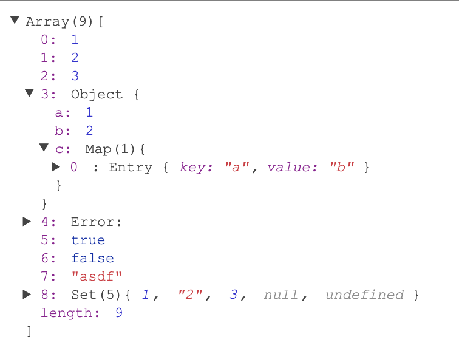

# svelte-json-tree



Svelte JSON Viewer Component. Supports [Map](https://developer.mozilla.org/en-US/docs/Web/JavaScript/Reference/Global_Objects/Map), [Set](https://developer.mozilla.org/en-US/docs/Web/JavaScript/Reference/Global_Objects/Set), [Iterable](https://developer.mozilla.org/en-US/docs/Web/JavaScript/Reference/Iteration_protocols#iterable), [Symbol](https://developer.mozilla.org/en-US/docs/Glossary/Symbol).

[Try it out on repl](https://svelte.dev/repl/89867bd1acaa48b4b29e29d1fdfa1ddf?version=3.14.1).

## Install

```sh
yarn install svelte-json-tree
```

## Usage

```html
<script>
  import JSONTree from 'svelte-json-tree'
  // your json data to view
  const value = {
    array: [1, 2, 3],
    bool: true,
    object: {
      foo: 'bar'
    }
  }
</script>
<JSONTree {value} />
```

## License
MIT